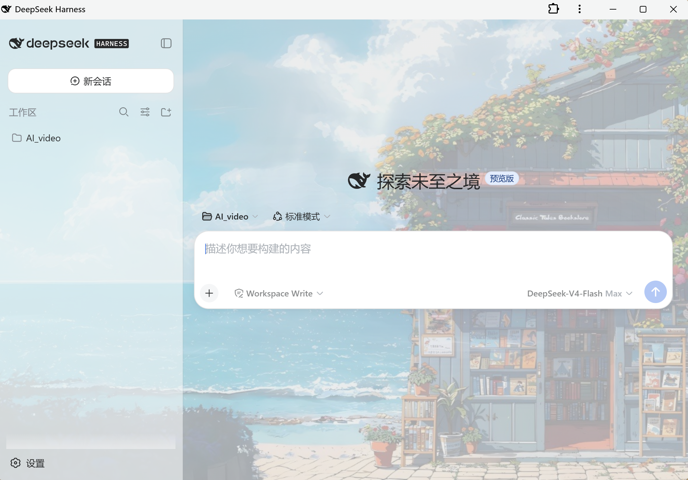
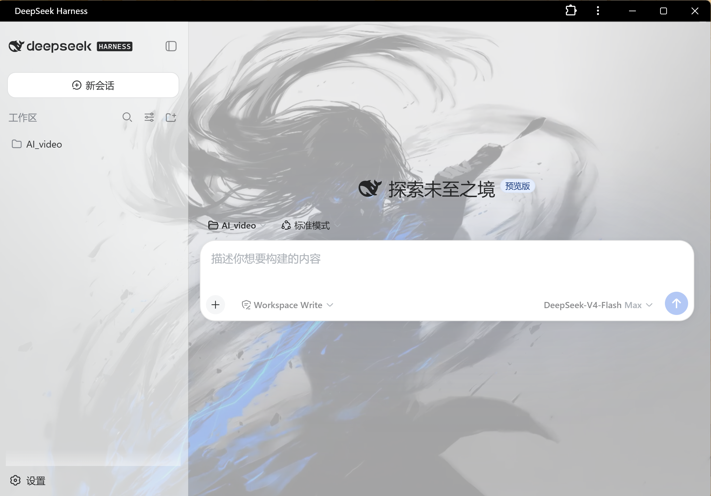

# dsh-image-skin — 图片皮肤 + Q 版宠物插件

## 效果图





## 功能

- **图片皮肤**：在 设置 → 图片皮肤 上传照片（可多选）到**图库**，点击缩略图**一键应用**：
  - k-means 提取主色/辅色/强调色，自动生成明暗两套主题 token（背景、面板、侧栏、边框、品牌强调色、文字色全部跟随图片主色调）
  - 图片作为页面背景（半透明面板透出图片），支持浓度、模糊（画布预烘焙）调节
  - 图库缩略图网格：当前应用项高亮"应用中"，右上角 × 可删除单项；图库存于浏览器本地
- **Q 版宠物**（右下角悬浮、可拖动、点击互动）：
  - 程序化生成：由主色/辅色/强调色自动绘制圆润大眼宠物，零依赖
  - AI 生成（可选）：设置里填 API Key（默认 MiniMax image-01 协议，兼容 OpenAI 风格），宿主端代理调用（`/api/dsh-image-skin`），参考图以 base64 随请求发送
- 状态保存在浏览器 localStorage，重启后自动恢复

## 结构

```
package.json          # dsh.bundle.patch + dsh.client.platform: web
cordis.patch.yml      # 组合插入行
lib/host.js           # 宿主端：/api/dsh-image-skin 路由（AI 生图代理 + probe）
lib/client.js         # 客户端：皮肤/调色板/宠物/设置页（__ModuleLoader__ 加载）
```

## 安装 Install

从 GitHub 安装（推荐）：

```sh
dsh plugin --profile web add github:jack-sun-learner/dsh-image-skin
```

本地开发安装（file: 源）：

```sh
dsh plugin --profile web add file:D:\AI_video\plugins\dsh-image-skin
```

安装后重启 web 服务生效。仓库地址：https://github.com/jack-sun-learner/dsh-image-skin

## 开发迭代注意

profile 对 file: 依赖是**复制**模式（非符号链接），修改源码后必须同步：

```powershell
$src = 'D:\AI_video\plugins\dsh-image-skin'
$dst = "$env:USERPROFILE\.dsh\profiles\web\node_modules\dsh-image-skin"
Copy-Item "$src\lib\client.js" "$dst\lib\client.js" -Force
Copy-Item "$src\lib\host.js"   "$dst\lib\host.js"   -Force
Copy-Item "$src\package.json"  "$dst\package.json"  -Force
Copy-Item "$src\cordis.patch.yml" "$dst\cordis.patch.yml" -Force
```

改完重启 web 服务生效。语法检查：`node --check lib/client.js lib/host.js`。

## 已知说明

- AI 生成接口协议：`POST {model, prompt, n, response_format, image_urls?}` + `Authorization: Bearer`；返回 `data[0].b64_json` 或 `url`。其他提供商若不兼容可改设置里的 API 地址/模型（提示词模板也可自定义）。
- 背景图方案：token 覆盖把应用面板底色变半透明 + body 背景挂图（叠加深色渐变遮罩保证文字对比度）。若某面板不支持半透明会显得不跟随，属预期。
